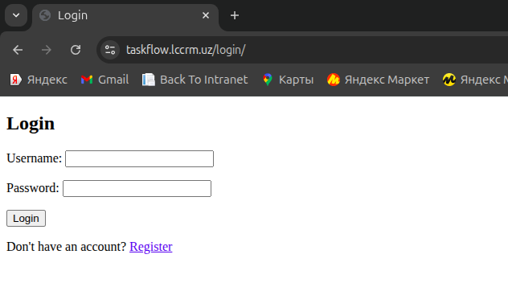
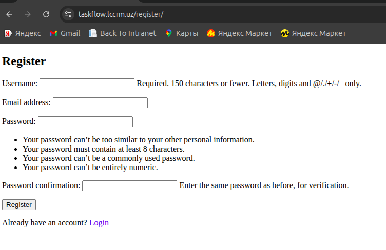
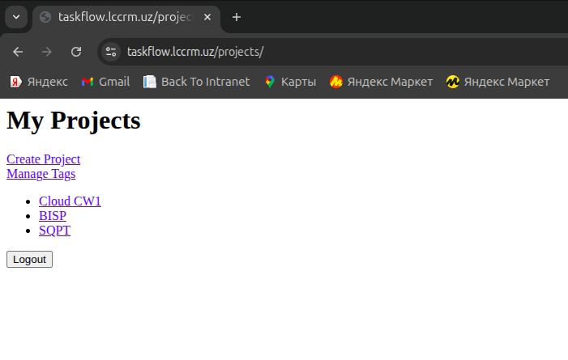
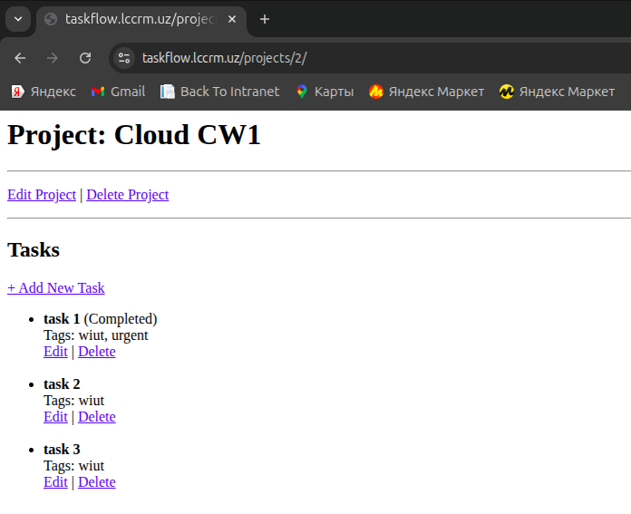
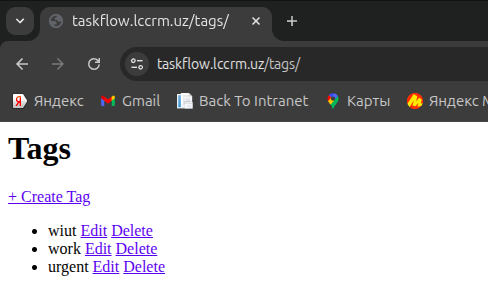
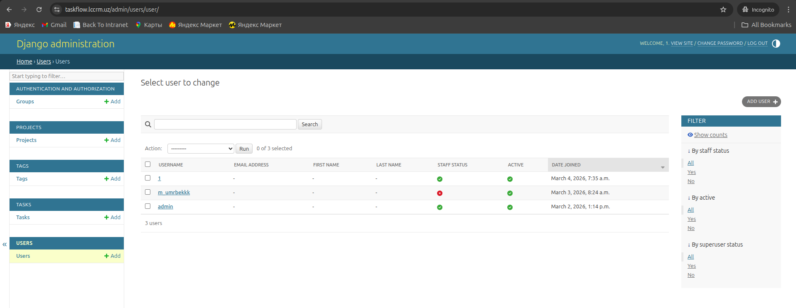

# TaskFlow – Django Project Management System

## Overview

TaskFlow is a Django-based web application for managing projects, tasks, and tags.
The system is containerized using Docker and deployed to an Azure virtual machine using a CI/CD pipeline.

The platform allows users to:

* Register and authenticate
* Manage projects
* Create and organize tasks
* Categorize tasks using tags

---

## Architecture

The system is deployed using the following architecture:

User → HTTPS → Nginx → Gunicorn → Django → PostgreSQL

* **Nginx** – Reverse proxy and SSL termination
* **Gunicorn** – WSGI application server
* **Django** – Web application framework
* **PostgreSQL** – Relational database
* **Docker** – Containerization
* **GitHub Actions** – CI/CD pipeline
* **Azure VM** – Hosting environment

---

## Technologies Used

* Python 3.12
* Django 6
* PostgreSQL 17
* Docker & Docker Compose
* Nginx
* Gunicorn
* GitHub Actions (CI/CD)
* Azure Virtual Machine
* Let's Encrypt SSL

---

## Features

* User authentication (login/register/logout)
* Project management
* Task tracking
* Tag categorization
* Dockerized production deployment
* CI/CD automated deployment pipeline

---

## Running the Project Locally

Clone the repository:

```
# ssh
git clone git@github.com:mumrbekkk/DSCC_CW1_16612.git

# https
git clone https://github.com/mumrbekkk/DSCC_CW1_16612.git

cd DSCC_CW1_16612
```

Create `.env` from `project_root/.example.dev.env` file:

```
POSTGRES_DB=task_flow_db
POSTGRES_HOST=postgres
POSTGRES_PORT=5432
# ⬇️ for local
#POSTGRES_HOST=localhost
#POSTGRES_PORT=5433

POSTGRES_USER=postgres
POSTGRES_PASSWORD=1234

SECRET_KEY=secret
DEBUG=True

DJANGO_SETTINGS_MODULE=core.settings.dev
```
Note: Here 5-6 lines are for running commands locally using same postgres container. 
When you enter a command you should uncomment those two lines and comment out above 2-3 rows \
e.g: python3 manage.py test \
WARNING: If you do not do the step in *Note you might get an error that db was not found or smth like that


Run with Docker:

```
docker compose -f docker-compose.dev.yml up -d --build
```

The application will be available at:

```
http://0.0.0.0:8000
```

---

## Deployment

### CI/CD Pipeline

The project uses **GitHub Actions** for continuous integration and deployment.

Pipeline stages:

1. Run flake8 linting
2. Apply database migrations
3. Run tests
4. Build Docker image
5. Push image to Docker Hub
6. Deploy to Azure VM using SSH
7. Health checks


### Production Deployment

The production stack consists of:

* Docker containers
* Gunicorn application server
* Nginx reverse proxy
* PostgreSQL database
* Let's Encrypt TLS certificate

The deployment process is automated through the CI/CD pipeline.

All needed on server is to create 3 files (from source code):

- docker-compose (docker-compose.prod.yml)
- nginx.conf (nginx.conf)
- .env (.example.prod.env)

#### Justification
Why not clone the repo? \
Yes it is possible do to so, but intentionally not to take server hard drive memory this approach has been used. 
And this advantage weighted more than the only small disadvantage, which is: "when your 2 files change you should first 
change them in VM first" which rarely happens since it is once configured and the source code (which fixes very often) comes in IMAGE.

---

## ENVs

### Dev env

```dotenv
POSTGRES_DB=task_flow_db
POSTGRES_HOST=postgres
POSTGRES_PORT=5432
# ⬇️ for local
#POSTGRES_HOST=localhost
#POSTGRES_PORT=5433

POSTGRES_USER=postgres
POSTGRES_PASSWORD=1234

SECRET_KEY=secret
DEBUG=True

DJANGO_SETTINGS_MODULE=core.settings.dev
```

### Prod env

```dotenv
POSTGRES_DB=task_flow_db
POSTGRES_HOST=postgres
POSTGRES_PORT=5432
# ⬇️ for local
#POSTGRES_HOST=localhost
#POSTGRES_PORT=5435

POSTGRES_USER=postgres
POSTGRES_PASSWORD=1234


SECRET_KEY=secret
DEBUG=False
ALLOWED_HOSTS=server_ip,domain_or_subdomain,localhost

DJANGO_SETTINGS_MODULE=core.settings.prod
```

## Docs of current running application

## Screenshots of Running Application

Below are screenshots demonstrating the main functionality of the deployed TaskFlow system.

### Login Page



---

### User Registration



---

### Project Dashboard



---

### Task Management



---

### Tag Management

Only for admin user



---

### Django Admin Panel




## Live Deployment

The application is deployed and accessible at:

https://taskflow.lccrm.uz

## Author

Umrbek Madatov
